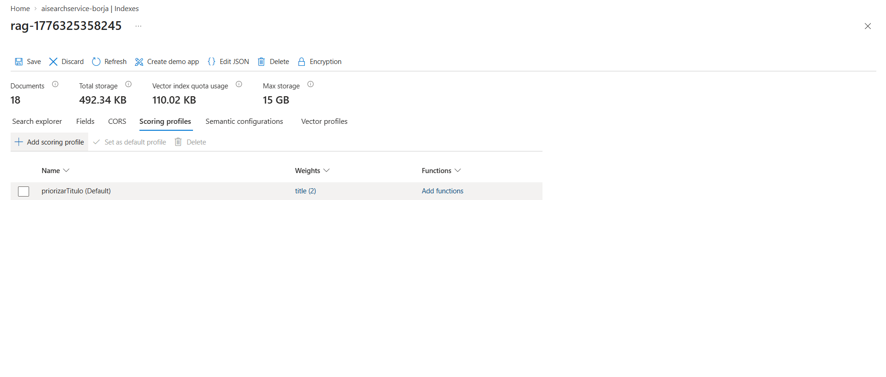

## ⭐ Extra elegido: Opción B (Scoring Profile)

He implementado un perfil de puntuación personalizado para mejorar la precisión del ranking en las búsquedas.

**Captura de la configuración:**

**Explicación:**
He configurado un **Scoring Profile** dentro del índice que aplica una técnica de "Boosting" sobre el campo `title`. 
- **Lógica aplicada:** Se ha asignado un peso (Weight) de **2.0** al campo de título en comparación con el peso de **1.0** del contenido.
- **Efecto:** Esto garantiza que si los términos de búsqueda del usuario aparecen en el título del documento, dicho resultado sea promocionado automáticamente a las primeras posiciones. Esto es especialmente útil en bibliotecas de documentos extensos donde el contexto principal suele estar definido en el encabezado, permitiendo un acceso más rápido a la información relevante.
