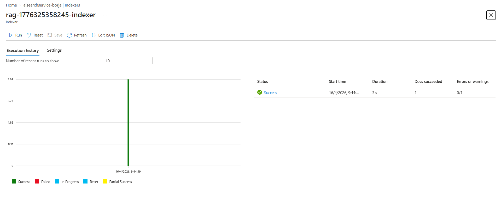
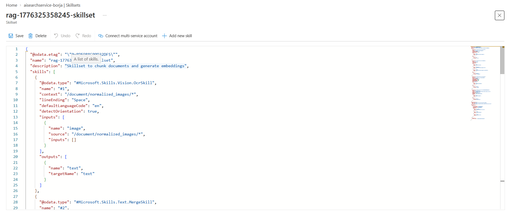
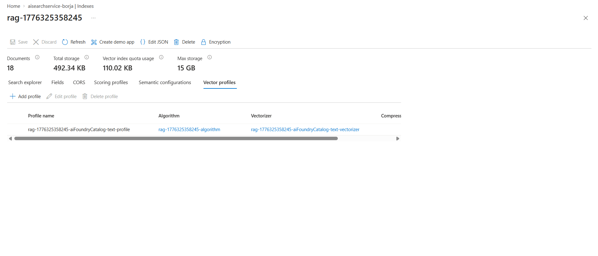
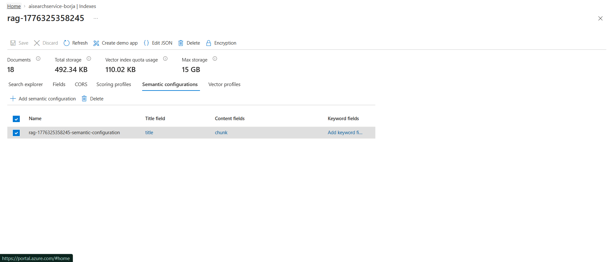

# ENTREGABLE PARTE 1 - Capturas y Explicaciones

A continuación se encuentran las capturas y explicaciones requeridas para evidenciar la correcta parametrización en el Azure Portal de nuestro entorno Vectorial RAG, siguiendo el flujo lógico de ingesta y búsqueda.

---

### 1. INDEXER

**Explicación:**
El Indexador (*Indexer*) es el motor encargado de orquestar y ejecutar todo el proceso de ingesta. Es el componente que "conecta los puntos": lee los documentos crudos de nuestro *Data Source* en Blob Storage, los pasa a través del *Skillset* para enriquecerlos y vectorizarlos, y finalmente escribe el resultado final en el *Índice*. En la captura se puede apreciar el historial de actividad, mapeando la frecuencia de actualización y confirmando que el proceso ha terminado con éxito (*Success*).

---

### 2. SKILLSET

**Explicación:**
Un Skillset es el conjunto de conductos de enriquecimiento (*Enrichment Pipeline*) impulsado por AI que actúa sobre cada documento antes de guardarlo. En nuestro proceso, el pipeline ejecuta primero OCR para extraer texto de imágenes, utiliza un `SplitSkill` para fraccionar documentos largos en párrafos manejables y, finalmente, llama a la skill nativa de `AzureOpenAIEmbeddingSkill` para traducir cada fragmento a vectores matemáticos (*embeddings*).

---

### 3. ÍNDICE (Index schema)

**Explicación:**
El índice es la base de datos donde se organiza la información final. Define qué "columnas" o campos almacenaremos (título, contenido, metadatos) y cómo se tratarán. Crucialmente, aquí se definen los campos de tipo `Collection(Edm.Single)` que almacenarán nuestros vectores para permitir búsquedas por significado y no solo por coincidencia exacta de letras.

---

### 4. VECTOR PROFILE

**Explicación:**
El perfil vectorial define la infraestructura de búsqueda matemática:
- **Algorithm (HNSW):** El algoritmo *Hierarchical Navigable Small World* crea un mapa de grafos para encontrar "vecinos cercanos" rapidísimo, evitando comparar nuestra pregunta con cada dato del índice.
- **Vectorizer:** Actúa como un traductor automático que se encarga de llamar a nuestro modelo de OpenAI para convertir las búsquedas del usuario en vectores de forma transparente.

---

### 5. SEMANTIC CONFIGURATION

**Explicación:**
La configuración semántica es la capa de "inteligencia extra". Utiliza modelos profundos de lenguaje para realizar un re-ranking de los resultados. Una vez obtenida la lista de documentos, este motor los reordena basándose en el contexto real de la pregunta humana, priorizando aquellos fragmentos que realmente responden a la intención del usuario.
