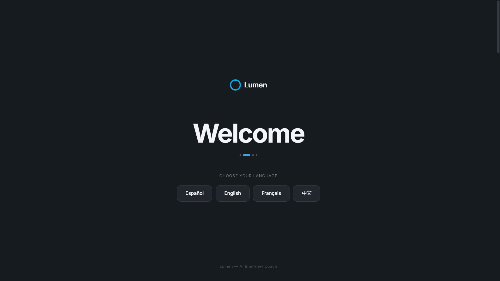
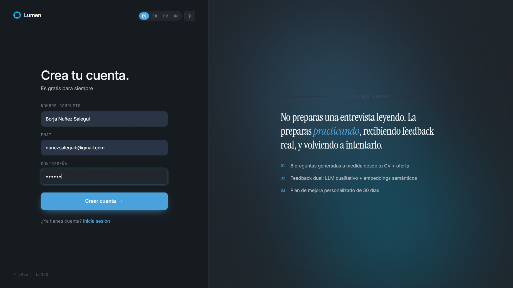
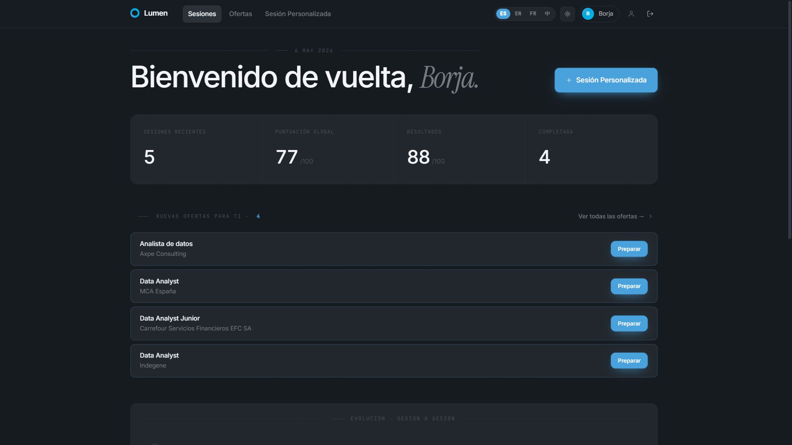
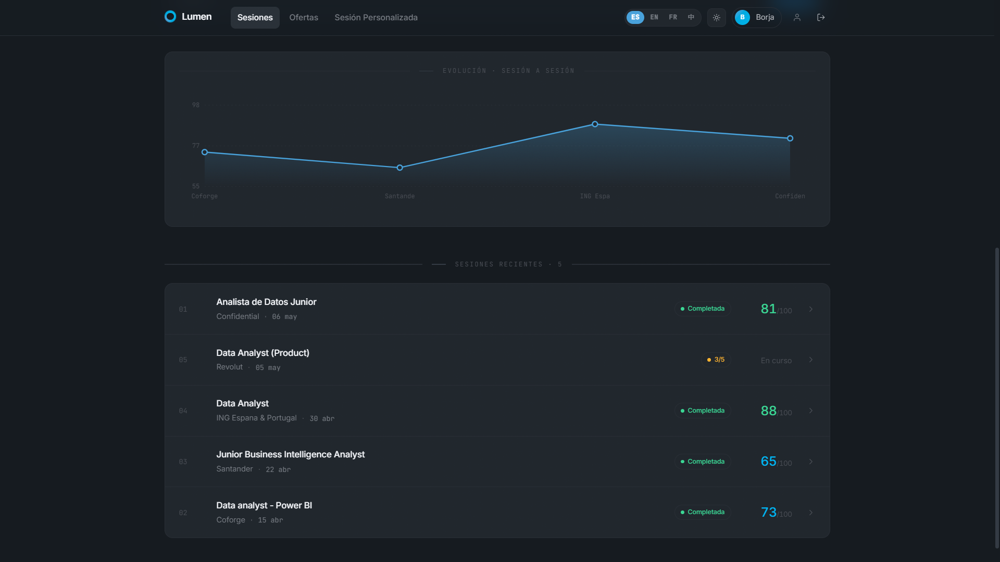
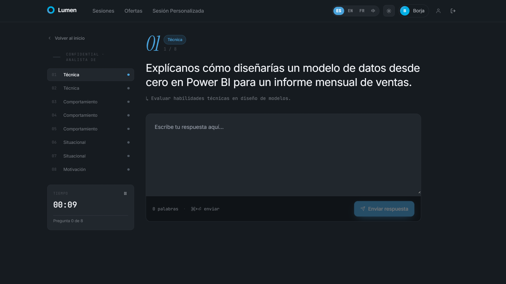
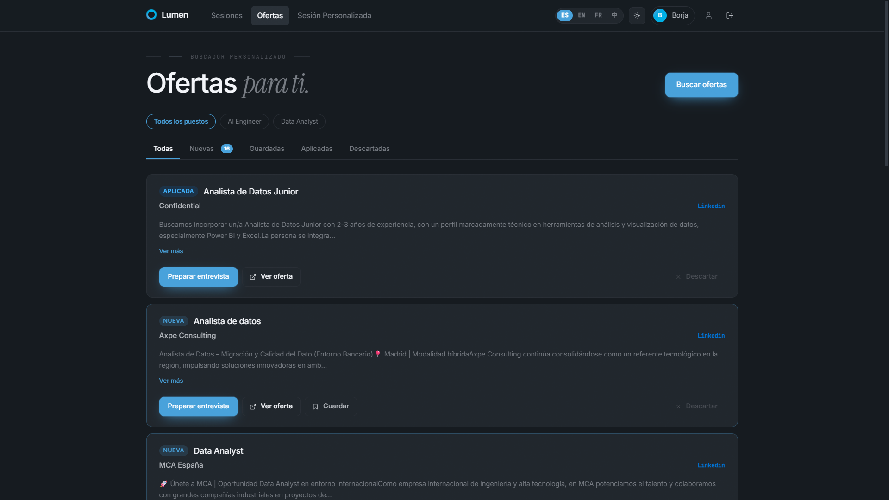
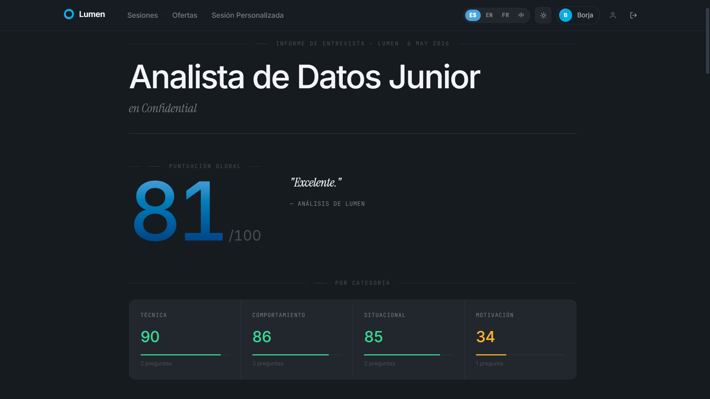
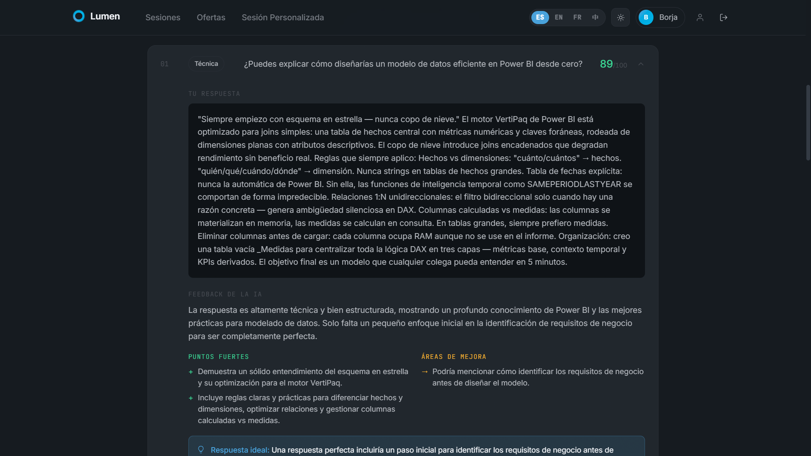
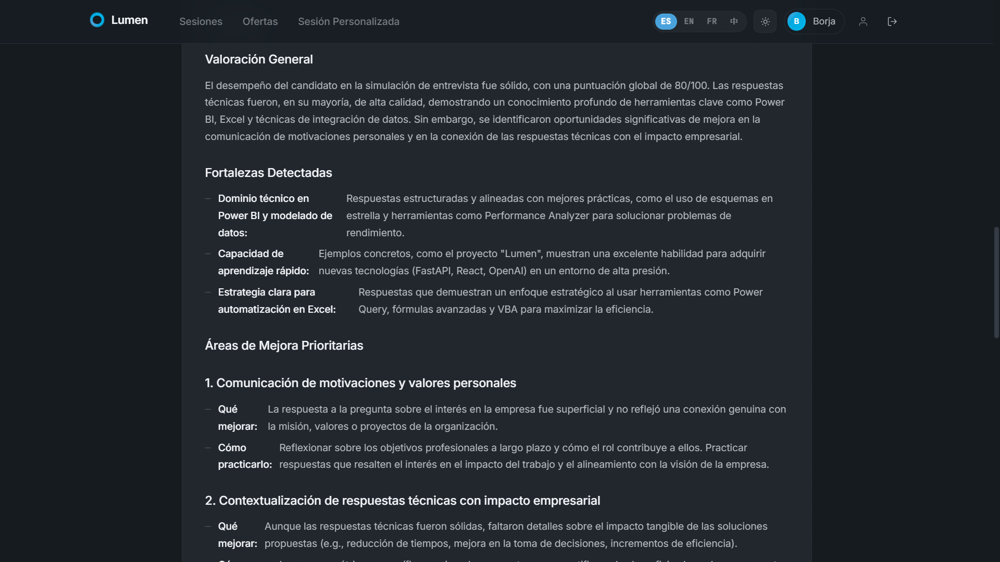

<div align="center">

# ⚡ Lumen — AI Interview Coach

**Plataforma SaaS de simulación de entrevistas potenciada por Inteligencia Artificial**

[](https://perpetual-surprise-production-4562.up.railway.app)
[](https://fastapi.tiangolo.com)
[](https://react.dev)
[](https://azure.microsoft.com/en-us/products/ai-services/openai-service)
[](https://railway.app)

*Proyecto final — Máster en IA y Big Data · 2025*

---

### 🔗 [perpetual-surprise-production-4562.up.railway.app](https://perpetual-surprise-production-4562.up.railway.app)

</div>

---

## ¿Qué es Lumen?

Lumen es un coach de entrevistas con IA que **personaliza cada simulación** en función del puesto al que aspiras y de tu propio CV. No son preguntas genéricas: el modelo lee la oferta de trabajo, analiza tu experiencia y genera una entrevista hecha a medida.

Cuando terminas, no solo ves una nota — recibes **feedback accionable** pregunta a pregunta, un desglose por categorías y un **plan de mejora de 30 días** generado por GPT-4o.

---

## Capturas de pantalla

<div align="center">

**Bienvenida — selector de idioma**


<br/>

**Registro — acceso gratuito**


<br/>

**Dashboard — estadísticas globales y sesiones recientes**



<br/>

**Entrevista — pregunta a pregunta con temporizador**


<br/>

**Ofertas de empleo personalizadas**


<br/>

**Resultados — puntuación global y desglose por categoría**


<br/>

**Resultados — feedback detallado por pregunta**


<br/>

**Resultados — plan de mejora de 30 días generado por GPT-4o**


</div>

---

## Funcionalidades principales

### 🎯 Entrevistas 100% personalizadas
Introduce el puesto, la empresa y pega la descripción de la oferta. Lumen genera **8 preguntas adaptadas** a ese rol específico, distribuidas en cuatro categorías:

| Tipo | Cantidad | Qué evalúa |
|------|:--------:|-----------|
| Técnicas | 2 | Habilidades específicas del rol |
| Conductuales | 3 | Experiencias pasadas (método STAR) |
| Situacionales | 2 | Toma de decisiones ante escenarios hipotéticos |
| Motivación | 1 | Fit cultural y objetivos profesionales |

### 📊 Sistema de scoring dual
Cada respuesta recibe una puntuación combinada con dos señales independientes:

```
Score final = 65% × GPT-4o (calidad y estructura)
            + 35% × Embeddings (cobertura semántica)
```

- **GPT-4o** evalúa si la respuesta es buena: estructura, relevancia, profundidad.
- **text-embedding-ada-002** mide si cubre los conceptos clave esperados, aunque uses palabras distintas. Convierte la respuesta y los puntos ideales en vectores de 1536 dimensiones y calcula la similitud coseno.

### 💬 Feedback inmediato por pregunta
Tras cada respuesta recibes de forma instantánea:
- Puntuación 0–100 con veredicto (Excelente / Buena / Mejora necesaria / Deficiente)
- Lista de fortalezas detectadas en tu respuesta
- Áreas de mejora concretas y accionables
- Hint sobre qué incluiría una respuesta perfecta

### 🔄 Sistema de reintentos
¿No estás contento con tu respuesta? Puedes **reescribirla** tras completar la sesión y ver si mejoras tu puntuación. Queda registrada la evolución entre el intento original y el reintento, con indicador de delta (▲/▼).

### 📋 Plan de mejora de 30 días
Al completar la sesión, GPT-4o analiza el conjunto de respuestas y genera un plan personalizado con:
- Valoración general honesta y constructiva basada en tus respuestas reales
- Fortalezas detectadas con evidencia directa de lo que dijiste
- Áreas de mejora priorizadas con pasos de práctica concretos
- Calendario de acción semana a semana
- Recursos específicos recomendados (libros, plataformas, cursos)

### 💼 Ofertas de empleo personalizadas
El sistema analiza tu perfil (nivel de experiencia, roles objetivo, sector, modalidad) y te sugiere ofertas relevantes. Puedes marcarlas como guardadas, aplicadas o descartadas, y preparar una entrevista directamente desde la oferta con un solo clic.

### 📄 Parseo inteligente de CV
Sube tu CV en PDF y Lumen extrae el texto con **pdfplumber** y lo estructura con GPT-4o: nombre, años de experiencia, historial de empleos, skills técnicas, idiomas y educación. Queda guardado en tu perfil para futuras sesiones.

### 🌍 Multiidioma completo
Interfaz completamente traducida: **Español · English · Français · 中文**. Todos los textos de la UI, mensajes de error y validaciones están internacionalizados con i18next.

---

## Arquitectura

```
┌─────────────────────────────────────────────────────────────┐
│                        Usuario                              │
└─────────────────────────┬───────────────────────────────────┘
                          │  HTTPS
┌─────────────────────────▼───────────────────────────────────┐
│                  Railway  (Docker)                          │
│                                                             │
│   ┌─────────────────────────────────────────────────────┐   │
│   │  FastAPI  (Python 3.11)                             │   │
│   │                                                     │   │
│   │  /api/auth/*       Registro, login, JWT             │   │
│   │  /api/sessions/*   Entrevistas + scoring            │   │
│   │  /api/cv/*         Extracción PDF (pdfplumber)      │   │
│   │  /api/profile/*    Perfil y CV del usuario          │   │
│   │  /api/jobs/*       Ofertas y matches                │   │
│   │  /*                React SPA (build estático)       │   │
│   └──────────────────────┬──────────────────────────────┘   │
│                          │                                  │
│   ┌──────────────────────▼──────────────────────────────┐   │
│   │  SQLite + SQLAlchemy                                │   │
│   │  users · sessions · questions · answers · jobs      │   │
│   └─────────────────────────────────────────────────────┘   │
└─────────────────────────┬───────────────────────────────────┘
                          │
┌─────────────────────────▼───────────────────────────────────┐
│                   Azure OpenAI                              │
│                                                             │
│   gpt-4o                  Genera preguntas, evalúa          │
│                           respuestas, crea plan de mejora   │
│                                                             │
│   text-embedding-ada-002  Scoring semántico por             │
│                           similitud coseno (1536 dims)      │
└─────────────────────────────────────────────────────────────┘
```

---

## Flujo completo de una sesión

```
1. El usuario sube su CV (PDF)
         │
         ▼
   pdfplumber extrae el texto plano página a página
         │
         ▼
   GPT-4o estructura el CV en JSON
   (nombre, skills, experiencia, idiomas, educación)

2. El usuario crea una sesión
   (puesto + empresa + descripción de la oferta)
         │
         ▼
   GPT-4o lee la oferta + el CV y genera 8 preguntas
   personalizadas con sus puntos clave de respuesta ideal

3. El usuario responde cada pregunta
         │
         ├──▶ GPT-4o evalúa calidad, estructura y relevancia
         │    → llm_score (0–100)
         │
         ├──▶ ada-002 convierte respuesta e ideal en vectores
         │    similitud coseno normalizada → embedding_score (0–100)
         │
         └──▶ final_score = 0.65 × llm_score + 0.35 × embedding_score

4. El usuario completa la sesión
         │
         ▼
   Puntuación global = media de todos los final_scores
         │
         ▼
   GPT-4o recibe el resumen completo de preguntas,
   respuestas y puntuaciones
         │
         ▼
   Plan de mejora personalizado de 30 días (Markdown)
```

---

## Stack tecnológico

### Backend
| Tecnología | Versión | Uso |
|-----------|:-------:|-----|
| **FastAPI** | 0.115 | Framework API REST asíncrono |
| **SQLAlchemy** | 2.0 | ORM + gestión de modelos |
| **SQLite** | — | Base de datos embebida |
| **python-jose** | 3.3 | Generación y validación de JWT |
| **passlib + bcrypt** | — | Hash seguro de contraseñas |
| **pdfplumber** | 0.11 | Extracción de texto de PDFs |
| **APScheduler** | 3.10 | Tareas programadas en background |
| **openai SDK** | 1.57 | Cliente para Azure OpenAI |
| **numpy** | 2.2 | Cálculo de similitud coseno |
| **pydantic-settings** | 2.6 | Gestión de variables de entorno |

### Frontend
| Tecnología | Versión | Uso |
|-----------|:-------:|-----|
| **React** | 18 | UI reactiva basada en componentes |
| **TypeScript** | 5.6 | Tipado estático |
| **Vite** | 6.0 | Build tool y dev server |
| **React Router** | 7.0 | Navegación SPA |
| **Axios** | 1.7 | Cliente HTTP con interceptors JWT |
| **i18next** | 26 | Internacionalización (ES/EN/FR/ZH) |
| **react-hook-form** | 7.5 | Gestión de formularios |

### Infraestructura
| Tecnología | Uso |
|-----------|-----|
| **Docker** | Build multi-etapa (Node.js 20 + Python 3.11) |
| **Railway** | Hosting, despliegue continuo y dominio público |
| **Azure OpenAI** | GPT-4o + text-embedding-ada-002 |

---

## Modelos de datos

```
User
 ├── id, email, name, password_hash
 ├── experience_level, target_roles[], target_locations[]
 ├── target_modality, target_industries[], practice_language
 └── cv_text, cv_parsed, cv_filename

Session
 ├── id, user_id, job_title, company, job_description
 ├── status (active | completed)
 ├── overall_score, improvement_plan
 └── created_at, completed_at
      │
      └── Question
           ├── question_text, question_type, focus
           ├── ideal_answer_points (JSON)
           └── Answer
                ├── answer_text, feedback_text
                ├── strengths[], improvements[]
                ├── ideal_answer_hint
                ├── llm_score, embedding_score, final_score
                ├── verdict
                └── RetryAnswer (mismos campos)

UserJobMatch
 ├── user_id, job_offer_id
 └── status (new | saved | applied | discarded)

JobOffer
 ├── title, company, location, description
 └── url, source, modality, salary_range
```

---

## Ejecutar en local

### Requisitos
- Python 3.11+
- Node.js 20+
- Cuenta en Azure con deployments de `gpt-4o` y `text-embedding-ada-002`

### Backend

```bash
cd backend

# Crear entorno virtual
python -m venv .venv
.venv\Scripts\activate        # Windows
source .venv/bin/activate     # macOS / Linux

pip install -r requirements.txt
```

Crea el archivo `backend/.env` (copia de `.env.example`):

```env
AZURE_OPENAI_ENDPOINT=https://tu-recurso.openai.azure.com/
AZURE_OPENAI_API_KEY=tu-api-key
AZURE_OPENAI_GPT4O_DEPLOYMENT=gpt-4o
AZURE_OPENAI_EMBEDDINGS_DEPLOYMENT=text-embedding-ada-002
SECRET_KEY=genera-con-python-secrets-token-hex-32
```

```bash
uvicorn main:app --reload
# API disponible en http://localhost:8000
# Documentación en http://localhost:8000/docs
```

### Frontend

```bash
cd frontend
npm install
npm run dev
# App disponible en http://localhost:5173
```

---

## Variables de entorno

| Variable | Descripción |
|----------|-------------|
| `AZURE_OPENAI_ENDPOINT` | URL base del recurso Azure OpenAI |
| `AZURE_OPENAI_API_KEY` | Clave de API de Azure |
| `AZURE_OPENAI_GPT4O_DEPLOYMENT` | Nombre del deployment de GPT-4o |
| `AZURE_OPENAI_EMBEDDINGS_DEPLOYMENT` | Nombre del deployment de embeddings |
| `SECRET_KEY` | Clave para firma de JWT — mínimo 32 bytes aleatorios |

Generar `SECRET_KEY` seguro:
```bash
python -c "import secrets; print(secrets.token_hex(32))"
```

---

## Estructura del repositorio

```
Proyecto6-SaaS/
│
├── backend/
│   ├── routers/
│   │   ├── auth.py             # Registro, login, /me
│   │   ├── sessions.py         # Crear sesión, responder, completar, reintentar
│   │   ├── cv.py               # Parseo de PDF con pdfplumber
│   │   ├── profile.py          # Perfil de usuario y CV persistente
│   │   └── jobs.py             # Ofertas de empleo y matches
│   ├── services/
│   │   ├── ai_service.py       # Toda la lógica de IA (GPT-4o + embeddings)
│   │   └── scheduler_service.py
│   ├── models.py               # Modelos SQLAlchemy
│   ├── schemas.py              # Schemas Pydantic (request/response)
│   ├── database.py             # Configuración SQLite
│   ├── dependencies.py         # Middleware JWT (get_current_user)
│   ├── config.py               # Lectura de variables de entorno
│   ├── main.py                 # Entrada FastAPI + sirve el SPA en producción
│   ├── requirements.txt
│   └── .env.example
│
├── frontend/
│   ├── src/
│   │   ├── pages/
│   │   │   ├── WelcomeScreen.tsx   # Selector de idioma (primera visita)
│   │   │   ├── Login.tsx
│   │   │   ├── Register.tsx
│   │   │   ├── Dashboard.tsx       # Historial de sesiones del usuario
│   │   │   ├── NewSession.tsx      # Formulario de nueva entrevista
│   │   │   ├── Interview.tsx       # Entrevista en curso (pregunta a pregunta)
│   │   │   ├── Results.tsx         # Resultados completos + plan de mejora
│   │   │   ├── Jobs.tsx            # Ofertas de empleo personalizadas
│   │   │   └── Profile.tsx         # Perfil, CV y preferencias
│   │   ├── locales/
│   │   │   ├── es.json
│   │   │   ├── en.json
│   │   │   ├── fr.json
│   │   │   └── zh.json
│   │   ├── components/
│   │   │   ├── Layout.tsx
│   │   │   └── Icon.tsx
│   │   ├── services/api.ts         # Cliente Axios con interceptors
│   │   ├── types.ts
│   │   └── i18n.ts
│   ├── package.json
│   └── vite.config.ts
│
├── Dockerfile                  # Build multi-etapa: Node 20 → Python 3.11
├── .dockerignore
├── nixpacks.toml
└── README.md
```

---

<div align="center">

Desarrollado por **Borja Núñez Salegui y Álvaro Lopez Redondo**

Máster en IA y Big Data · 2025

</div>
