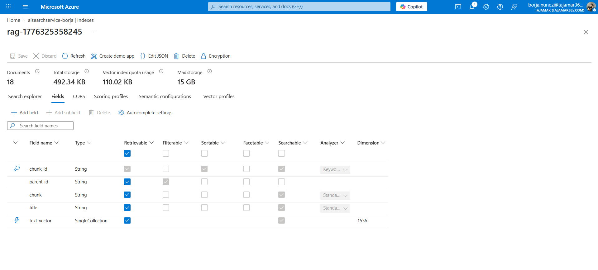

# ENTREGABLE PARTE 1 - Capturas y Explicaciones

A continuación se encuentran las capturas y explicaciones requeridas para evidenciar la correcta parametrización en el Azure Portal de nuestro entorno Vectorial RAG.

### 1. ÍNDICE (Index schema)
[]

**Explicación:**
El índice es la estructura de datos que organiza la información dentro del servicio de Azure AI Search. Define qué campos se almacenarán, cómo se indexarán (si serán buscables por texto, por vectores, o ambos) y qué tipo de datos contienen. En nuestro caso, hemos definido campos para el título, contenido, metadatos y, crucialmente, campos vectoriales para permitir la búsqueda semántica.

### 2. SEMANTIC CONFIGURATION
[]

**Explicación:**
La configuración semántica potencia la relevancia de los resultados de búsqueda. En lugar de limitarse al simple conteo de coincidencias de palabras clave o a la proximidad estricta de vectores, utiliza los potentes *Modelos de Ranking Semántico* (Deep Neural Networks de Microsoft) para "reordenar" los resultados en base al contexto real y la intención de la búsqueda. Permite configurar explícitamente cuáles campos son el 'Título' y cuáles el 'Contenido' para priorizar estructuralmente la información durante el proceso de *reranking*.

---

### 3. VECTOR PROFILE
[]

**Explicación:**
El perfil vectorial en Azure especifica cómo la base de datos almacena, busca y trata los vectores:
- **Algorithm (HNSW):** Las siglas corresponden a *Hierarchical Navigable Small World*. Es un algoritmo súper eficiente de búsquedas por vecinos más cercanos (ANN). Evita que la consulta se compare contra absolutamente todos los datos individualizados y, en su lugar, traza "atajos" geométricos entre las capas de grafos (navigable small worlds) para devolver información rapidísimo.
- **Vectorizer:** Actúa como un traductor automático bajo el capó (Integrated Vectorization). En nuestro caso está conectado al despliegue en de Embeddings (`text-embedding-ada-002`) de nuestra cuenta en AI Foundry. Su función es convertir las *queries* que lanza el usuario en texto natural a un vector "en el acto", sin que se requiera llamar a una API de Embedding separada antes de buscar.

---

### 4. SKILLSET
[]

**Explicación:**
Un Skillset es el conjunto de conductos de enriquecimiento (*Enrichment Pipeline*) impulsado por AI que actúa sobre cada documento original ingerido: 
En nuestro asistente, el pipeline ejecuta primero OCR sobre las imágenes anexas y luego utiliza un `SplitSkill` para fraccionar documentos largos en pequeños bloques o párrafos para no sobrepasar el límite de la "Ventana de Contexto" de lectura. Por último, engarza la skill nativa de `AzureOpenAIEmbeddingSkill` para vectorizar autónomamente todos esos minúsculos fragmentos extrayendo sus respectivas coordenadas multi-dimensionales en el vector database.
